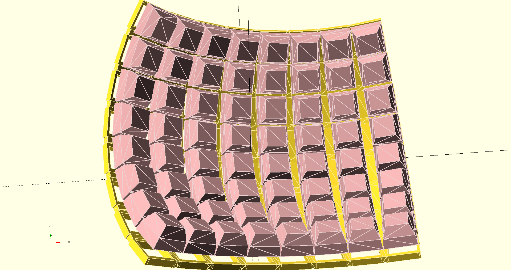
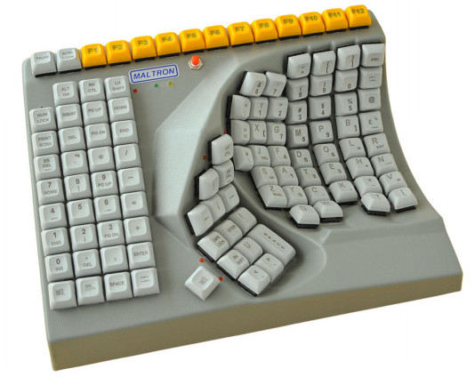

# trochee

## Rationale - what is "accessibility"?

There are many reasons and situations where one would find themselves without use of one or both of their hands. Injuries, child-rearing, and probably countless others I haven't thought of. Usually though, unless the reason is permanent, it is not worth the monetary investment to justify a $400-$1000 Maltron keyboard. I think this is a major problem, and if there were a cheaper option, more people would enjoy a more productive lifestyle while in these compromising situations.

The Trochee keyboard is a parameterized, concave, columnar, ergonomic keyboard with a focus on accessibility. See the [design documentation](./doc/design.md) for full details.

It is based on the [Dactyl](https://github.com/adereth/dactyl-keyboard) (Pictured below):

Then cross that with the [Maltron](https://www.maltron.com/):

## Generating a design

1. Install the [Clojure CLI](https://clojure.org/guides/getting_started#_clojure_installer_and_cli_tools)

2. Install [OpenSCAD](http://www.openscad.org/)

3. Generate `.scad` files by evaluating the code in `src/trochee.clj`.

4. Open generated files in `OpenSCAD`.

5. Edit, repeat as needed, and export to `STL` in `OpenSCAD` to print the model.

## Deploy

To build a deployable jar of this library:

    $ clojure -A:jar

Install it locally:

    $ clojure -A:install

Deploy it to Clojars -- needs `CLOJARS_USERNAME` and `CLOJARS_PASSWORD` environment variables:

    $ clojure -A:deploy

## License

Copyright © 2020 Bobby Towers

Distributed under the Eclipse Public License either version 1.0 or (at
your option) any later version.
